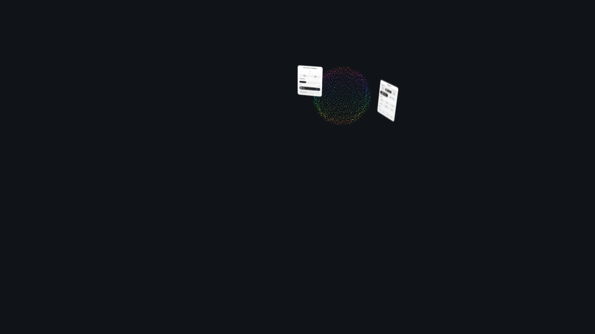
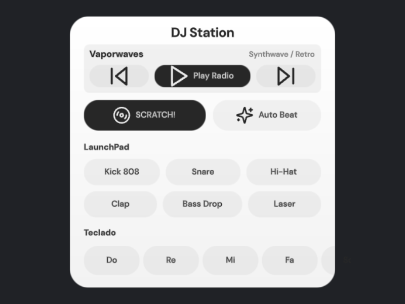
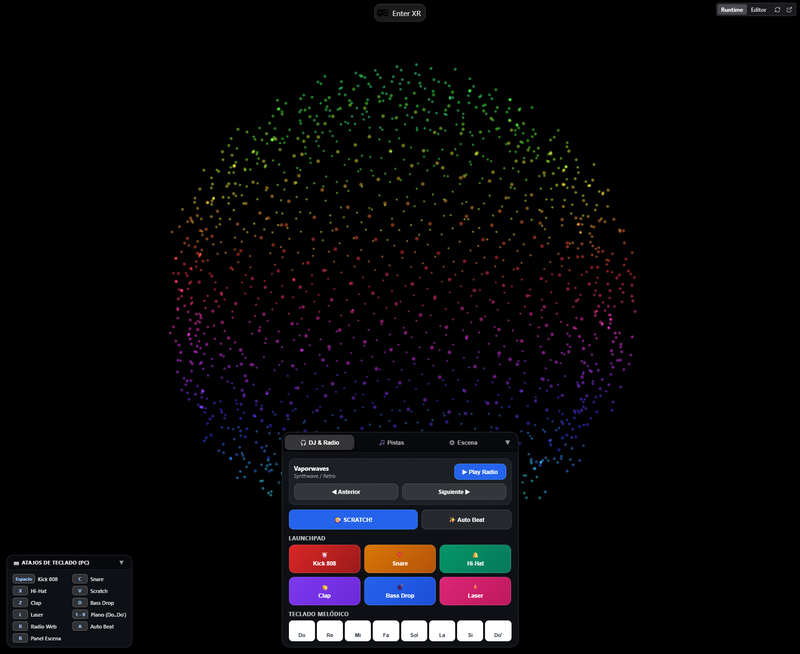

# Point Cloud Music Visualizer & DJ Station

Un visualizador de música y estación de sonido interactiva en 3D diseñado para **Realidad Virtual, Realidad Mixta (Meta Quest 3)** y accesible también desde **computadoras y teléfonos celulares**.

---

## 🌟 ¿De qué se trata el proyecto?

Imagina una esfera brillante compuesta por 1800 puntos de luz flotando en medio de tu habitación. Al reproducir música, esta esfera cobra vida: los golpes de batería empujan su base, los tonos agudos hacen chispear su cúpula y los colores bailan al ritmo de la melodía.

Puedes tomar la esfera con tus manos virtuales, moverla por tu cuarto, cambiar su tamaño y sumergirte en tu música favorita como nunca antes.

---

## 🎛️ ¿Qué puedes hacer en la aplicación?

### 1. Disfrutar de la Esfera Musical Reactiva
- **Danza de Frecuencias**: Cada altura de la esfera escucha una parte de la música. Los bajos sacuden la base y los platillos brillan arriba.
- **Detector de Ritmo**: Cuando la música golpea con fuerza, la esfera lanza destellos y pulsos rítmicos.
- **Física e Interacción**: En realidad virtual puedes acercarte, agarrar la esfera con las manos y acomodarla en cualquier rincón de tu espacio.

### 2. Estación DJ y Sonidos en Vivo
No necesitas tener canciones guardadas: el proyecto incluye una controladora DJ completa inspirada en tornamesas profesionales:
- **Tornamesa de Scratch**: Desliza el plato para hacer el clásico sonido de vinilo de DJ en tiempo real.
- **LaunchPad de Ritmos y Efectos**: Botones con sonidos inmediatos de bombo, caja, platillos, aplausos, caídas de bajo (bass drop) y rayos láser.
- **Teclado Musical**: 8 notas de piano afinadas para tocar tus propias melodías sobre la música.
- **Auto Beat**: Un botón que activa una base de batería a 120 BPM para que la esfera baile sola mientras exploras.

### 3. Radio por Internet 24/7
Conéctate al instante con estaciones de radio en streaming continuo (música electrónica, synthwave retro y lo-fi relajante) con solo presionar un botón, sin necesidad de descargar archivos.

### 4. Reproductor de Pistas Propias
Si prefieres escuchar tus canciones favoritas en MP3, puedes reproducirlas, pausarlas, saltar pistas y ajustar qué tan sensible quieres que sea la esfera al volumen.

---

## 📱 Dos Maneras de Vivirlo (Adaptado a cualquier dispositivo)

El proyecto detecta automáticamente desde dónde te conectas para darte la mejor experiencia:

1. **Desde tu Computadora o Celular (Modo 2D)**:
   - Se ocultan los paneles del mundo virtual para darte una vista limpia de la esfera.
   - Aparece un menú moderno en la parte inferior con botones táctiles para tu teléfono y soporte para teclado de computadora.
   - En tu PC puedes usar atajos de teclado como la barra espaciadora para el bombo o las teclas del 1 al 8 para el piano.

2. **Con Gafas de Realidad Virtual / Mixta (Meta Quest)**:
   - Entra en modo inmersivo para ver la esfera flotar en tu sala real (Passthrough) o en un entorno virtual.
   - La tornamesa y el reproductor aparecen como consolas holográficas flotantes a tus costados.
   - El panel de ajustes viaja pegado a tu muñeca derecha y aparece con solo presionar el botón "B" de tu control.

---

## 🎮 Controles de Teclado (Para PC)

| Tecla | Acción |
|---|---|
| **Barra Espaciadora** | Bombo (Kick 808) |
| **C** | Caja (Snare) |
| **X** | Platillo (Hi-Hat) |
| **V** | Scratch de DJ |
| **Z** | Aplauso (Clap) |
| **D** | Caída de bajo (Bass Drop) |
| **L** | Efecto Láser |
| **1 al 8** | Notas de piano (Do a Do') |
| **R** | Encender / Pausar Radio |
| **A** | Ritmo automático (Auto Beat) |
| **B** | Menú de ajustes de la escena |

---

## 🚀 Cómo Iniciar la Experiencia

1. Inicia el servidor de la aplicación en tu computadora.
2. Abre el enlace [https://localhost:8082/](https://localhost:8082/) en tu navegador (o la dirección IP local en tu visor Meta Quest).
3. ¡Sube el volumen y disfruta del espectáculo de luces y sonido!
